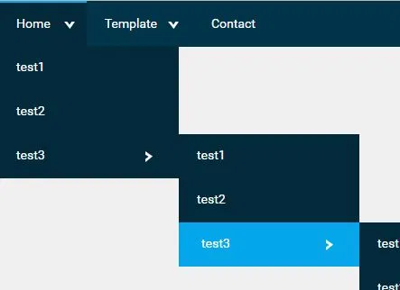
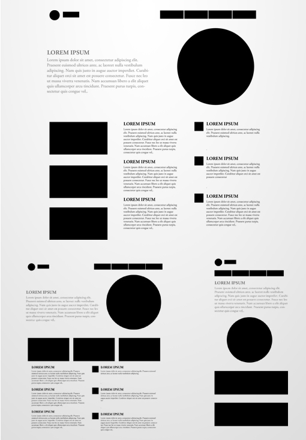

# P217_21.01.21_CSS-Position_Flex

- Checkout HTML CSS Layouts
  - https://www.w3schools.com/css/css_website_layout.asp
  - https://www.w3schools.com/w3css/w3css_templates.asp
- Checkout HTML CSS 12x Grid System
  - https://www.w3schools.com/css/css_rwd_grid.asp
- Repeat CSS Pseudo-elements (::before, ::after)
  - https://www.w3schools.com/css/css_pseudo_elements.asp
  - https://css-tricks.com/pseudo-element-roundup/
  - https://css-tricks.com/almanac/selectors/a/after-and-before/
  - [CSS: :before and :after pseudo elements in practice](https://krasimirtsonev.com/blog/article/CSS-before-and-after-pseudo-elements-in-practice)
  - Additional video - https://youtu.be/-bwR9S5MmOI
- Repeat CSS Positioning (relative, absolute, fixed, sticky)
  - https://developer.mozilla.org/en-US/docs/Web/CSS/position
- Flexbox resources to read
  - Complete this article and try examoles - https://css-tricks.com/snippets/css/a-guide-to-flexbox/
  - https://www.w3schools.com/css/css3_flexbox.asp
  - https://developer.mozilla.org/en-US/docs/Web/CSS/CSS_Flexible_Box_Layout/Basic_Concepts_of_Flexbox

## Assigments:
- Create dropdown menu. Using hover and positioning.

   - 
   
- Solve all the [FlexboxFroggy](http://flexboxfroggy.com/) examples 1-by-1.
- Develop this page using **Flexbox technique**
  
   - 

## Some usefull resources:

- https://cssarrowplease.com/
- CSS Position: https://youtu.be/jx5jmI0UlXU
- http://www.chunqiuyiyu.com/css-centering-explorer/
- [Common CSS Flexbox Layout Patterns with Example Code](https://tobiasahlin.com/blog/common-flexbox-patterns/#stretch-all-fixed-spacing)
